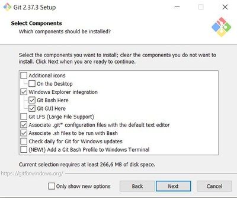
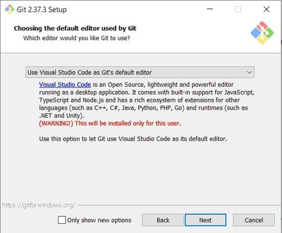
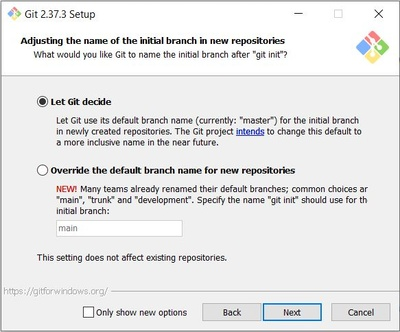
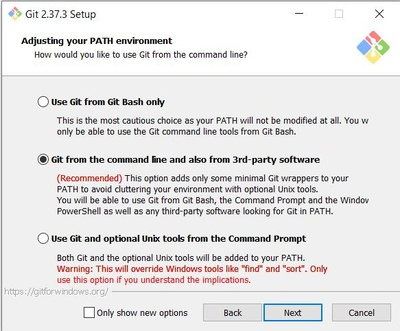
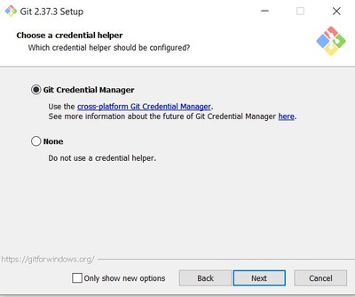

# Praca z systemem kontroli wersji Git

## 1. Pobranie i instalacja systemu Git

### Pobierz tutaj https://git-scm.com/downloads
* możliwa obsługa poprzez wiersz polecenia (również poprzez emulator bash)
* możliwa jest integracja z Exploratorem systemu Windows.



### Wybór domyślnego edytora 
* Może się przydać do edycji plików konfiguracyjnych lub plików repozytorium.
* Zalecany: Visual Studio Code
 


### Nazewnictwo


### Dostosowanie zmiennej środowiskowej PATH
wpływ na sposób obsługi narzędzia git poprzez wiersz polecennia.
* Pierwsza opcja pozwala na użycie polecenia git tylko poprzez Git Bash (który powinniśmy wybrać do instalacji w kroku 1), 
* Druga opcja to **zalecane ustawienie** (Git Bash oraz terminal windowsowy).



### Kolejne opcje pozostawiamy domyślne
* Use OpenSSH, 
* Use the OpenSSL library,
* Checkout Windows-style,
* use MinTTY,
* Default (fast-forward or merge). 

### Wybór menedżera poświadczeń (credential manager).

* Jeżeli na jednym koncie systemu pracuje *wielu użytkowników* powinniśmy wybrać opcję -> **None**, 
spowoduje brak zapisywania poświadczeń w systemie i kolejni użytkownicy nie będą musieli usuwać/zmieniać poświadczeń w przypadku uwierzytelniania do tych samych serwisów, np. Github.
> #### Aktualnie zapisane poświadczenia można w systemie Windows znaleźć tu:
> Panel sterowania -> Konta użytkowników -> Menedżer poświadczeń.
* ***Wybieramy Git Credential Manager***
* Zmiany związane są m.in. z podniesieniem zabezpieczeń przez serwis GitHub. Można doczytać więcej pod adresem: https://github.com/Microsoft/Git-Credential-Manager-for-Windows

### Na kolejnym oknie aktywujemy opcję Enable file system caching 
### Na ostatnim oknie nie zaznaczamy użycia eksperymentalnego wsparcia pseudo konsol.


## 2. Wstępna konfiguracja
- Przejdz do folderu, w którym chcesz zacząć śledzić zmiany. 
- Nowe repozytorium inicjalizujemy komendą:
```
git init
```
- W folderze, w którym polecenie zostało uruchomione pojawi się ukryty folder o nazwie _.git_, w którym znajdują się informacje o naszym repozytorium.
- Zostanie również utworzona gałąź (_ang. branch_) master. 
- W przypadku pracy wielu osób na tym samym koncie systemu operacyjnego należy skonfigurować jeszcze parametry _user.name_ oraz _user.email_, które będą się pojawiały w _commitach_, które w trakcie pracy będą wykonywane.
```
git config --local user.name akowalski
git config --local user.email akowalski@gmail.com
```
- W przypadku, gdy chcemy ustawić takie dane dla każdego repozytorium, które będzie tworzone na tym koncie możemy zamienić --local na --global lub --system.
- Należy wtedy pamiętać, że wciąż lokalnie dla konkretnego repozytorium możemy te wartości nadpisać.
- Kolejną rzeczą, którą należy wykonać jest wyłączenie domyślnej integracji Visual Studio Code z windowsowym menedżerem poświadczeń, który będzie przechowywał dane logowania do serwisu GitHub innych użytkowników utrudniając pracę kolejnym, którzy będą chcieli wypychać zmiany do swojego zdalnego repozytorium. Możemy to zrobić poleceniem:
```
git config --system --unset credential.helper
```
- Warto również sprawdzić czy nie ma takiego ustawienia w innych zakresach konfiguracji.
```
git config --global -l
git config --local -l
```
Jeżeli jest to tutaj również usuwamy ten parametr.

## 3. Podstawowe komendy systemu Git
Po konfiguracji narzędzia Git możemy teraz dodać coś do naszego repozytorium poleceniem:
```
git add plik.txt
```
Powyższe polecenie dodaje plik _plik.txt_ do poczekalni (_ang. stage area_). Możemy również dodać wszystkie pliki w bieżącej lokalizacji:
```
git add *
```
- Warto pamiętać, że w zależności od wykożystanego narzędzia mogą pojawić się
pliki konfiguracyjne (raczej nie potrzebne gdy chcemy udostępnić repozytorium dla innych użytkowników, którzy mogą chcieć korzystać z innego narzędzia niż nasze i będą musieli samodzielnie pousuwać nie potrzebne pliki.)
- Zalecanym krokiem przed dodaniem czegokolwiek do repozytorium jest przygotowanie pliku _.gitignore_ zawierającego reguły (wyrażenia regularne), które spowodują, że spełniające je zasoby będą przez narzędzie Git ignorowane przy śledzeniu zmian. 
- Jednak należy pamiętać, że w przypadku modyfikacji _.gitignore_ powinniśmy usunąć śledzenie zasobów, najwygodniej po prostu:
```
git rm *
```
i ponownie
```
git add *
```
aby Git dodał wszystko ignorując te zawarte w _.gitignore_ .

Jeżeli zasoby, które chcemy śledzić są już dodane możemy wykonać ich zatwierdzenie.
```
git commit -m "pierwszy commit"
```
- Spowoduje to stworzenie nowej migawki zasobów znajdujących się w folderze roboczym (czyli wszystkiego tego co jest aktualnie widoczne w eksplorerze projektu) czyli z poczekalni. 
- Każdy commit ma swój unikalny hashcode. 
- Dzięki commitom możemy wracać do stanów zapisanych w tych migawkach. 
- Im częściej wykonujemy commit po istotnych zmianach tym rzadziej będzie zdarzała się sytuacja, gdzie utracimy istotne dane lub wprowadzone zmiany wymuszą na nas powrót do poprzedniego stanu tracąc znaczną część pracy.

### Podpięcie lokalnego repozytorium do nowego zdalnego repozytorium
#### Krok 1
- Tworzymy nowe repozytorium zdalne, w trakcie zajęć korzystamy z serwisu **GitHub**. 
- Po jego utworzeniu wyświetlona zostanie strona z komendami, które powinny nam pomóc przy procesie synchronizacji. 
- Komendy, włączające pierwszy commit, można pominąć gdyż zostało to już zrobione w nieco inny sposób. 
- Dla lokalnego repozytorium wskazujemy zdalne repozytorium, do którego będziemy chcieli kod wypychać.
```
git remote add origin https://github.com/user/repo.git
```
Powyższe polecenie jest właściwe jeżeli nie korzystamy z klucza SSH (lepsze rozwiązanie, jeżeli tylko my korzystamy z danego konta w systemie operacyjnym), gdyż nie wymaga każdorazowego podawania poświadczeń przy wypychaniu zmian. Dodajemy informację o nowym zdalnym repozytorium o aliasie _origin_ i podanym _url- u_.

Jeżeli chcemy sprawdzić jaki jest adres zdalnego repozytorium to
```
git remote get-url origin
```
a jeżeli trzeba go zmienić
```
git remote set-url origin https://nowy.adres.repo
```
#### Krok 2
```
git push -u origin master
```
- Powyższe polecenie próbuje wysłać aktualną gałąź (i jej stan z wykonanego ostatnio commitu) do zdalnego repozytorium z adresu przypisanego do aliasu (origin) do zdalnej gałęzi master. 
- Tutaj może się pojawić kilka problemów (błędów), które mogą tę operację uniemożliwić. 
  - Jeżeli otrzymamy komunikat mówiący, że wypchanie nie jest możliwe, bo użytkownik o nazwie xxx nie posiada uprawnień oznacza to, że w menedżerze poświadczeń są zapisane poświadczenia do serwisu GitHub innego użytkownika (mogą pochodzić z innego narzędzia). -> Należy usunąć wszystkie poświadczenia, które odwołują się do serwisu GitHub i ponowić próbę wypchania zmian. Można ponowić operację wypchania zmian.
  - Może się tutaj również pojawić problem jeżeli w zdalnym repozytorium znajdują się jakieś zasoby, których lokalnie nie ma (np. dodany domyślny plik _readme.md_). -> Wtedy możemy wykonać polecenie _push_ z dodatkowym parametrem, wymuszającym wypchanie (_force_):
```
git push -f origin master
```
  - Pierwszy push do zdalnego repozytorium może się nie udać jeżeli pierwotna zawartość obu repozytoriów jest różna, np. w repozytorium GitHub została wybrana opcja stworzenia pliku _readme.md_. Wtedy wykonujemy kolejny krok.

#### Pobranie repozytorium w inne miejsce/komputer
- Jeżeli chcemy kontynuować pracę z zawartością repozytorium na innym komputerze, narzędziu to wystarczy przejść do folderu, w którym chcemy umieścić repozytorium, np. folder z innymi projektami i wykonać polecenie:
```
git clone https://link.do.repo
```
- To polecenie utworzy nowy folder o nazwie takiej jak nazwa zdalnego repozytorium i umieści tam już informacje o jego stanie (folder _.git_) oraz informacji o _remote_ (ten sam, z którego został sklonowany). 
- Teraz wystarczy skonfigurować user.name oraz user.email w przestrzeni _--local_, jeżeli nie ma poprawnych ustawień globalnych (pracujemy na tym samym koncie co inni użytkownicy) i można dalej pracować, zatwierdzać zmiany i wypychać je ponownie do zdalnego repozytorium.

### Masz ochotę na więcej?
Zajrzyj tutaj: [git-scm.com.](https://git-scm.com/book/pl/v2)
